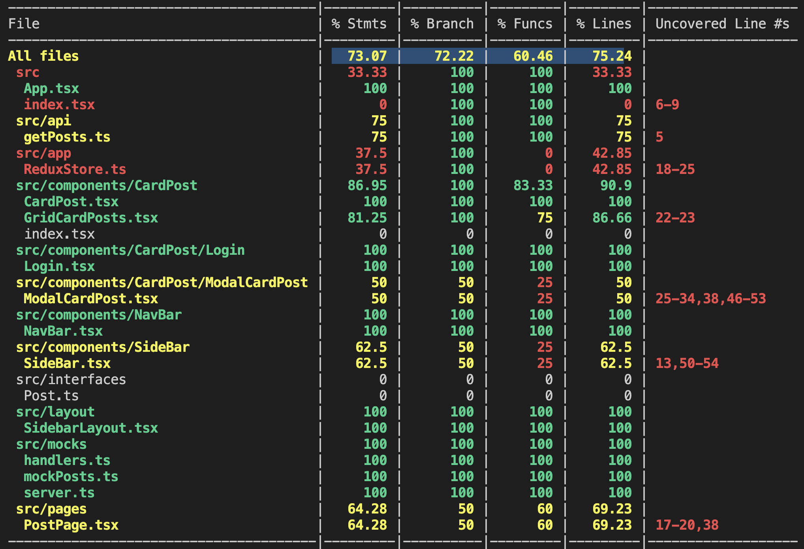

Table Posts - An app to visualize posts which can be both edited and removed.

<a href="https://leafy-semifreddo-cd3cef.netlify.app/">
 
  Go to the Table Posts App deployed online.
</a>

### Key features

- Login.
- Call posts API to list posts.
- Add random image to the post.
- Edit posts.
- Remove posts.
- Test coverage near 70%.

### Installation steps.
This project can be locally installed with the following steps.
```bash
yarn
```
or
```bash
npm install
```

### Run steps
This project can be locally runned with the following steps.

```bash
yarn start
```
or
```bash
npm start
```

### Test steps
The test can be launched with:
```bash
yarn test
yart test:coverage
```
or
```bash
npm test
npm test:coverage
```

  

